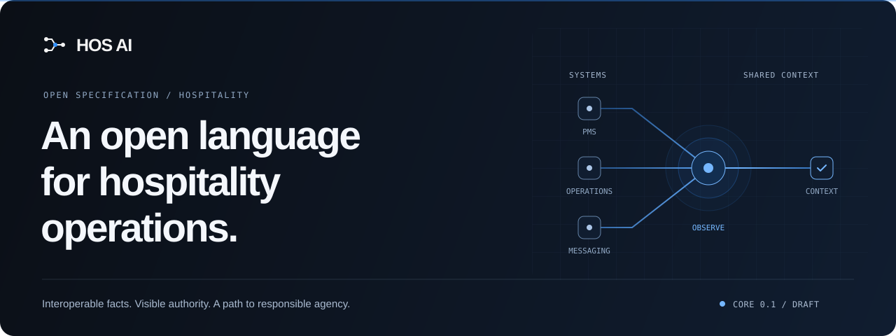
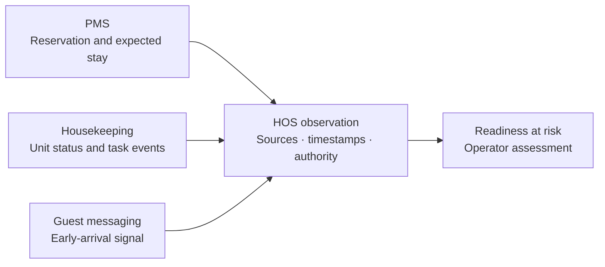

<p align="center">
  
</p>

<h1 align="center">Hospitality operations. Open by design.</h1>

<p align="center">
  <strong>Hospitality Operating Specification for Agentic Infrastructure</strong><br />
  Building a shared operational language for the systems and people that run hospitality.
</p>

<p align="center">
  <a href="#why-hos-ai">Why HOS AI</a> ·
  <a href="#the-first-proof">First proof</a> ·
  <a href="#project-status">Status</a> ·
  <a href="#run-locally">Run locally</a> ·
  <a href="#contribute">Contribute</a>
</p>

---

## Why HOS AI

A guest arrives early. The reservation system expects them. Housekeeping still marks the room as dirty. A message announces their arrival. Each system holds part of the answer; the team needs one understandable situation.

**HOS AI is building an open specification to make operational facts, capabilities and controlled actions portable across hospitality systems.** The aim is to give operators, software providers and future agents a common contract, with the source and authority of every fact still visible.

The proposed specification complements property management systems (PMS) and existing standards. Its design leaves infrastructure choices with participants: no mandatory broker, cloud or central database.

| Interoperable facts                                           | Trustworthy control                                            | A path to agency                                                              |
| :------------------------------------------------------------ | :------------------------------------------------------------- | :---------------------------------------------------------------------------- |
| Shared identifiers, versioned events and explicit provenance. | Declared authority, tenant boundaries and reviewable evidence. | A progression from observation to recommendations and approval-bound actions. |

These are the specification's design commitments. This repository contains the **HOS AI website and its local development backend**; the operational contract is still taking shape.

## The first proof

**Early arrival. Room not ready. A risk made visible.**

HOS Core 0.1 starts with a focused arrival-readiness scenario. The proposed flow brings facts from the PMS, housekeeping and guest messaging into a traceable projection that an operator can assess.



The illustrative output is `arrival.room_readiness_at_risk`. Conflicting facts retain their provenance. This first phase observes; booking changes and check-in actions remain outside its scope.

The website replays this scenario at `/demo` with a small, non-normative reference projection run against a synthetic conformance corpus. Two more scenarios put the same projection to other causes of a room not ready for its guest:

| Scenario                              | Where                     | What happens                                                                                                                                                                           |
| :------------------------------------ | :------------------------ | :------------------------------------------------------------------------------------------------------------------------------------------------------------------------------------- |
| Early arrival, unit not ready         | `/demo`                   | The guest will come three hours early and the room is not released. A duplicate, a conflicting status, a late message and a snapshot along the way.                                    |
| Assigned unit out of order            | `/demo/room-out-of-order` | A leak on the arrival morning. A maintenance system plans the repair, the PMS copies it without being the authority, an older revision syncs late, and the front desk moves the guest. |
| Late check-out on a same-day turnover | `/demo/late-checkout`     | A late check-out is granted in a room already promised to an arrival. A room attendant's glance is not a check-out, and the risk resolves only when the PMS records the departure.     |

Each scenario's files are in [`public/spec/0.1/conformance/`](public/spec/0.1/conformance): producer manifests, the event stream and the expected outcome an implementation must reproduce.

`/demo/mews`, `/demo/apaleo` and `/demo/cloudbeds` replay the same scenario with its PMS side recorded in a real PMS API's format: webhooks, then the entities an integration fetches. For each PMS, an experimental reference adapter turns them into HOS events and reaches the same expected outcome. The mappings are unofficial. They are built with synthetic data from each PMS's published documentation, packages or SDK, and Mews and Apaleo have since run against live demo data. Their notes list what each taught us about HOS 0.1: [Mews](public/spec/0.1/mappings/mews/README.md), [Apaleo](public/spec/0.1/mappings/apaleo/README.md) and [Cloudbeds](public/spec/0.1/mappings/cloudbeds/README.md). Those findings added the following to the HOS 0.1 draft:

- `stay.unit_unassigned` and `stay.check_in_reverted`;
- the `hosactor` envelope attribute and the `modified` time basis;
- standard check-in and check-out times on the Property;
- rules for when `stay.expected` is due and for producers without a guest identity;
- scheduled maintenance windows, which all three PMSs have: a ninth Core entity and the `unit.maintenance_scheduled` and `unit.maintenance_cancelled` events.

`npm run mews:live`, `npm run apaleo:live` and `npm run cloudbeds:live` run each mapping, read-only, against a live environment: Mews's public demo, a free Apaleo developer account, or a Cloudbeds sandbox or property key. They report whether real data maps to valid HOS events, whether a second pass publishes anything again, and today's arrivals as the reference projection sees them.

| PMS       | Live environment                                              | HOS facts | Schema errors | Published twice |
| :-------- | :------------------------------------------------------------ | --------: | ------------: | --------------: |
| Mews      | Both public demo enterprises, 25 September 2026               |     3,485 |             0 |               0 |
| Apaleo    | Five sample hotels of a developer account, 26 September 2026  |       740 |             0 |               0 |
| Cloudbeds | Not run yet: it needs a partner sandbox or a property API key |         — |             — |               — |

The runs changed the integrations. Mews assigns dorm stays to beds, so beds are now units, and accommodation is picked by resource category rather than by how a service is sold. Apaleo refuses an out-of-order maintenance on a room already assigned to a reservation. See the [Mews](public/spec/0.1/mappings/mews/README.md#live-check), [Apaleo](public/spec/0.1/mappings/apaleo/README.md#live-check) and [Cloudbeds](public/spec/0.1/mappings/cloudbeds/README.md#live-check) notes.

Each live check also records what the adapter publishes, with its manifest, and runs the producer check on it: the manifest states its limitations, every fact is valid and declared, and a restarted adapter publishes the same facts with the same ids. On 26 September 2026 it passed on both Mews demo enterprises, 3,232 facts, and on the five Apaleo sample hotels, 769 facts.

A validator CLI, SDKs, a production event processor and live PMS connectors are future work.

## Project status

**Early-stage initiative · HOS Core 0.1 and HOS Events 0.1 drafts · Website online at [hos-ai.vercel.app](https://hos-ai.vercel.app)**

| Area                                       | Where it stands                                                                                                                                                                                                    |
| :----------------------------------------- | :----------------------------------------------------------------------------------------------------------------------------------------------------------------------------------------------------------------- |
| Website                                    | Deployed from `master`: standard overview, HOS, HTNG and OpenTravel, manifesto, governance, roadmap, documentation status, changelog, live demos and participation pages.                                          |
| Participation forms                        | Local PostgreSQL persistence, encrypted payloads and filesystem notification records.                                                                                                                              |
| HOS Core and event model                   | Draft JSON Schemas in [`public/spec/0.1`](public/spec/0.1), documented at `/docs/core` and `/docs/events`.                                                                                                         |
| Producer manifests and arrival conformance | Draft manifest schema and signing rules, with signing test vectors, and three synthetic arrival scenarios, checked by the unit tests.                                                                              |
| Mappings and certification                 | Experimental, unofficial Mews, Apaleo and Cloudbeds mappings replay the arrival scenario; Mews and Apaleo have also run read-only against live demo data. No partner-backed or certified integrations are claimed. |
| Independent stewardship                    | An objective. HOS AI is working toward an independent HOS Foundation; no established foundation is claimed.                                                                                                        |
| Data Cooperative                           | A future, optional programme, separate from HOS Core. Not active.                                                                                                                                                  |

The website is deployed on Vercel from `master`. The participation forms still need a production database, and email delivery, analytics and anti-spam services still need configuration and review. Public release also requires founder decisions and the publisher details still marked "To complete" on the legal pages.

## Principles worth building around

- **Keep authority visible.** Preserve who asserted a fact, when it occurred and which system is authoritative.
- **Keep operational choice open.** Make the contract portable across infrastructure and vendor boundaries.
- **Use data with restraint.** The proposed Core favours minimal, pseudonymous data; message content stays with its authority system.
- **Earn the right to act.** Future actions are intended to be default-deny, policy-bound, approved and auditable.
- **Make evidence inspectable.** Public conformance work should use synthetic or irreversibly anonymised material.
- **Protect the commons.** The published governance direction gives funding and early participation no exclusive rights over the standard, member data or certification.

The intended stewardship model is member-led, with one organisation, one vote. These commitments describe the direction of the initiative, rather than a governance structure already in operation.

## Roadmap

Progress depends on evidence and operational readiness. Dates are deliberately left open.

| Stage              | Focus                                                                                       | Status                      |
| :----------------- | :------------------------------------------------------------------------------------------ | :-------------------------- |
| **01 · Observe**   | Core events, provenance, producer capabilities and a replayable arrival-readiness scenario. | Current specification focus |
| **02 · Act**       | Declared capabilities and policy-controlled commands with explicit human approval.          | Future                      |
| **03 · Trust**     | Versioned policies, approval records, audit evidence and bounded permissions.               | Future                      |
| **04 · Agents**    | Responsible agent manifests and portable operational guarantees.                            | Future                      |
| **05 · Ecosystem** | Certified profiles, mappings and voluntary interoperable participation.                     | Future                      |

## Explore the repository

The website uses **Next.js 16, React 19, TypeScript and Tailwind CSS 4**, with locally owned UI primitives, Lucide icons and a Docker-backed PostgreSQL 17 database for form development.

```text
app/                 Pages, metadata and form API routes
components/          Brand, navigation, UI, diagrams and participation forms
lib/content/         Audience messaging and documentation status
lib/forms/           Validation, encryption, persistence and local outbox
lib/analytics/       Allowlisted, payload-free browser event signals
lib/legal.ts         Publisher, host, processor and retention facts behind the legal pages
lib/hos/mappings/    Experimental PMS mappings and their recordings
lib/spec.ts          Where the site publishes the spec, and loaders for its conformance scenarios
packages/sdk/        @hos-ai/sdk: HOS types, validation, processing rules, manifest signing and the reference projection
packages/cli/        @hos-ai/cli: the hos command: validate, conformance run and producer, replay, manifest
examples/            Implementations outside TypeScript, such as the HOS dispositions in Python
database/migrations/ PostgreSQL schema migrations
scripts/             Migration and seed utilities, and the read-only PMS live checks
public/spec/0.1/     Draft HOS schemas, examples, conformance corpus and mapping recordings
tests/               Vitest unit tests and Playwright browser/accessibility checks
docs/operations/     Local operating procedures
docs/legal/          Record of processing activities
```

Start with the [homepage](app/page.tsx), [standard overview](app/standard/page.tsx), [manifesto](app/manifesto/page.tsx) or [governance commitments](app/governance/page.tsx). Shared audience copy lives in [site-copy.ts](lib/content/site-copy.ts).

## Run locally

### Prerequisites

- Node.js **22 or newer** and npm.
- Docker with Compose for the local PostgreSQL service.
- Git to clone the repository.

The commands below use PowerShell, matching the current development setup. In Bash or Zsh, use `cp` instead of `Copy-Item` and `npm` instead of `npm.cmd`.

### 1. Get the code

```powershell
git clone https://github.com/francoisnoel62/HOS-AI.git
cd HOS-AI
npm.cmd ci
Copy-Item .env.example .env.local
```

### 2. Configure local secrets

Generate two independent values:

```powershell
# FORM_ENCRYPTION_KEY — 32 bytes, base64 encoded
node -e "console.log(require('crypto').randomBytes(32).toString('base64'))"

# RATE_LIMIT_SALT — a separate random value
node -e "console.log(require('crypto').randomBytes(32).toString('hex'))"
```

Paste the corresponding values into `.env.local`. The other defaults are provided in [`.env.example`](.env.example); keep this populated local file private.

### 3. Start the database and apply migrations

```powershell
docker compose up -d --wait postgres
node --env-file=.env.local --import=tsx scripts/migrate.ts
```

The explicit `--env-file` loads the local database settings for the standalone migration script. The `npm.cmd run db:migrate` shortcut is also available when `DATABASE_URL` is already exported in your shell.

### 4. Start the website

```powershell
npm.cmd run dev
```

Open **[localhost:3000](http://localhost:3000)**. Next.js loads `.env.local` automatically. Explore `/standard`, `/roadmap`, `/governance` and `/participate` from the site navigation.

<details>
<summary><strong>What happens when you submit a local form?</strong></summary>

The form handler validates inputs, applies a honeypot and rate limit, and stores the submission in PostgreSQL. Submission payloads and contact email fields use AES-256-GCM encryption; operational metadata is stored separately.

Internal notifications and acknowledgements are written as JSON files to `data/outbox/`. These records include recipient addresses in plain text and remain local development data. No email is sent.

`LOCAL_FORMS_MODE=true` permits the local anti-spam bypass when no Turnstile secret is configured. Use it only on your own computer. Docker credentials in `docker-compose.yml` are development defaults.

Use synthetic test submissions. Guest data, credentials, API keys, exports and confidential commercial information do not belong in the public forms or repository.

</details>

## Development checks

Run the static checks, unit suite and production build:

```powershell
npm.cmd run typecheck
npm.cmd run lint
npm.cmd test
npm.cmd run build
```

Then install Chromium once and run the browser suite:

```powershell
npm.cmd exec playwright install chromium
npm.cmd run test:e2e
```

Playwright starts the production server on port `3100`, so **build before running browser tests**. The suite covers key navigation and participation flows, theme switching and automated accessibility checks in desktop and mobile browser profiles. Run `npm.cmd run test:a11y` for the accessibility subset.

The current [Playwright configuration](playwright.config.ts) invokes `npm.cmd`; contributors on macOS or Linux need to change its `webServer.command` to `npm run start -- --port 3100` for those checks.

Available scripts are listed in [`package.json`](package.json). Automated accessibility checks are part of the verification process, not a claim of complete accessibility conformance.

## Contribute

HOS needs both operational knowledge and technical care. Useful contributions today include clearer explanations, accessible interfaces, stronger form handling, tests and concrete feedback on the proposed contract.

| Your perspective               | A useful place to start                                                                                           |
| :----------------------------- | :---------------------------------------------------------------------------------------------------------------- |
| Hospitality operator           | Describe an arrival-readiness problem using a synthetic example and identify the systems that own each fact.      |
| PMS or software provider       | Review event meaning, identifiers, source authority and capability declarations.                                  |
| Integrator or developer        | Improve the website, local tooling, tests or documentation; propose replay and mapping requirements.              |
| Founding participant or patron | Review the participation paths and governance commitments, and help define the conditions for shared stewardship. |

For repository contributions:

1. [Open an issue](https://github.com/francoisnoel62/HOS-AI/issues) describing the problem, its context and the expected outcome. Discuss larger changes before implementing them.
2. Create a focused branch and make the change. Keep sample data synthetic and status claims grounded in available evidence.
3. Run the checks relevant to your change. For interface changes, inspect desktop and mobile layouts in both themes.
4. Open a pull request explaining the problem, the change and how it was verified. Add screenshots for visible interface changes.

The website also provides four participation paths: **founding member**, **pilot partner**, **technical contributor** and **financial patron**. In this local implementation, those forms save locally; they do not contact the project team.

## Operations and release readiness

Local procedures cover [submission review](docs/operations/submission-review.md), [delivery failures](docs/operations/delivery-failure.md), [privacy rights requests](docs/operations/rights-request.md), [abuse incidents](docs/operations/abuse-incident.md), [security issues](docs/operations/security-issue.md) and [content releases](docs/operations/content-release.md).

The current scope excludes accounts, payments, scheduling, a CMS, comments, newsletters, live PMS integrations and an active Data Cooperative. The local outbox is a development substitute for transactional email. Analytics currently emit only local browser events.

The [legal notice](app/legal/page.tsx), [privacy notice](app/privacy/page.tsx), [terms of use](app/terms/page.tsx) and [accessibility statement](app/accessibility/page.tsx) read their facts from [`lib/legal.ts`](lib/legal.ts). Details only the publisher can supply are marked "To complete" on the pages; `npm.cmd run legal:check` lists them and fails until none is left. The [record of processing activities](docs/legal/processing-register.md) mirrors the privacy notice.

A daily Vercel Cron job calls `/api/cron/purge` to delete submissions past their retention date and expired rate-limit keys; it needs a `CRON_SECRET` environment variable. Locally, run `npm.cmd run db:purge`.

Before public release, the founder must resolve the external service and stewardship decisions, complete the legal details, and review production configuration and delivery. Publishing this repository does not make the website ready to operate as a public service.

For security reports, follow the [security policy](SECURITY.md) and keep secrets, personal data and exploitable details out of public issues. `/.well-known/security.txt` is served once a security contact is set in `lib/legal.ts`.

## Licensing and identity

The website code is licensed under **[Apache-2.0](LICENSE)**.

The HOS 0.1 schemas, examples, conformance scenarios and mapping recordings in [`public/spec/0.1`](public/spec/0.1) are also Apache-2.0. The specification text, published at `/docs/core` and `/docs/events`, is under CC BY 4.0, separately from the code licence included in this repository. Contributions are accepted under Apache-2.0, section 5.

The HOS AI name, temporary mark, logo and editorial content are not granted for reuse by that code licence. The [legal notice](app/legal/page.tsx) sets out each licence.

---

<p align="center">
  <strong>An open operational language. A shared foundation for what comes next.</strong><br />
  Built with hospitality, for hospitality.
</p>
